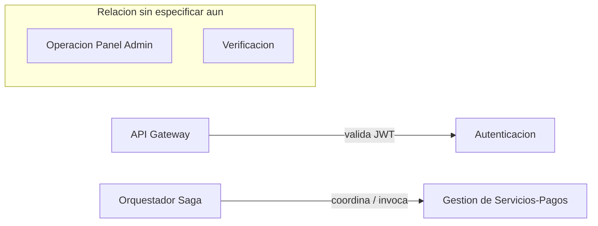

# Mapa de Dominios de Negocio

> **Estado de esta página:** actualizada a partir del diagrama de
> microservicios provisto por el equipo (2026-08-24). Reemplaza una
> versión anterior que usaba nombres de dominio más genéricos
> (Usuarios, Proveedores, Geolocalización, Búsqueda, Solicitudes, Pagos,
> Notificaciones, Reseñas, Administración). Esta versión refleja los
> microservicios reales que el equipo definió, y marca explícitamente qué
> quedó pendiente de confirmar con documentación adicional.

## Contexto

Antes de nombrar un solo microservicio, se identificaron los dominios de
negocio (bounded contexts) de Fixia. Este mapa es la fuente de verdad que
luego se traduce en el catálogo de microservicios (ver
[08-estructura-microservicios/catalogo-microservicios-fixia.md](../08-estructura-microservicios/catalogo-microservicios-fixia.md)).

## Microservicios identificados

| # | Microservicio | Responsabilidad (interpretada) | Tipo de datos crítico |
|---|---|---|---|
| 1 | **API Gateway** | Único punto de entrada para clientes externos. **Explícitamente no es dueño de datos propios** — solo enrutamiento, validación de JWT contra Autenticación, y cross-cutting concerns (rate limiting, logging). | Ninguno propio (por diseño) |
| 2 | **Autenticación** | Identidad, credenciales y emisión/validación de tokens JWT para clientes, proveedores y staff interno. | Credenciales, PII de identidad |
| 3 | **Descubridor** | Búsqueda y matching de proveedores cercanos por categoría, proximidad geográfica, disponibilidad y rating. | Ubicación en tiempo real + índices derivados de otros dominios |
| 4 | **Orquestador (Saga)** | Orquesta el flujo transaccional distribuido de una solicitud de servicio de punta a punta (creación → aceptación → ejecución → cierre), coordinando/invocando a otros microservicios mediante el patrón **Saga**. | Estado transaccional del negocio |
| 5 | **Gestión de Servicios/Pagos** | Catálogo de servicios ofrecidos por proveedores **y** procesamiento de pagos/comisiones/facturación. | Datos financieros (máxima sensibilidad) + perfil de servicios |
| 6 | **Procesamiento** | Ingesta y procesamiento de datos de alto volumen (implementado en Go, ver [go.md](../03-decisiones-arquitectura/lenguajes-frameworks/go.md)). | Depende del origen de datos ingeridos |
| 7 | **Calificaciones y Métricas** | Calificación post-servicio y métricas de reputación/desempeño de proveedores. | Contenido generado por usuario |
| 8 | **Verificación** | Validación de documentación e identidad de proveedores. | Documentos de identidad/verificación (alta sensibilidad) |
| 9 | **Operación (Panel Admin)** | Backoffice interno: moderación, soporte, gestión operativa del día a día. | Acceso privilegiado a otros dominios (vía API, no DB directa) |
| 10 | **Mensajería** *(serverless)* | Envío de notificaciones (push/email/SMS) ante eventos del sistema. Implementado en arquitectura serverless. | Bajo, pero alto volumen |

## ⚠️ Puntos pendientes de confirmar

Estos quedaron abiertos al procesar el diagrama y **deben cerrarse** con
la documentación adicional que el equipo va a enviar:

1. **Perfil de cliente/proveedor (antes "Usuarios"):** el diagrama no
   muestra un microservicio explícito para datos de perfil de cliente o
   proveedor más allá de credenciales (Autenticación) y servicios
   ofrecidos (Gestión de Servicios/Pagos). ¿Vive dentro de Autenticación,
   dentro de Gestión de Servicios/Pagos, o falta un microservicio en el
   diagrama?
2. **Gestión de Servicios/Pagos une dos perfiles de datos muy distintos**
   (catálogo de servicios de un proveedor + procesamiento financiero).
   El capítulo [01/por-que-microservicios.md](./por-que-microservicios.md)
   y la página [java.md](../03-decisiones-arquitectura/lenguajes-frameworks/java.md)
   asumían que "Pagos" era un dominio aislado por su nivel de sensibilidad.
   Con la fusión, conviene confirmar si el aislamiento de datos sensibles
   sigue resuelto **dentro** de este microservicio (ej. separación interna
   de esquemas) o si se mantiene como una fusión definitiva.
3. **Nombres de repositorio no confirmados:** `java.md` referencia
   `fixia-msv-pagos` y `fixia-msv-administracion`, pero el diagrama ya no
   tiene un microservicio llamado "Administración" a secas, sino
   **Operación (Panel Admin)** y **Verificación** por separado. Falta
   confirmar cuál de los dos (¿ambos?) es el que integra el SDK de la
   pasarela de pagos en Java, para corregir esa página.
4. **Patrón Saga (Orquestador):** es una técnica nueva no documentada
   todavía en `03-decisiones-arquitectura/tecnicas-metodos/`. Falta crear
   su página de decisión propia.
5. **Serverless (Mensajería):** es una plataforma nueva no documentada
   todavía en `03-decisiones-arquitectura/plataforma-infraestructura/`.
   Falta su página de decisión (proveedor, runtime, por qué serverless
   acá y no contenedor con K3s como el resto).
6. **Relaciones entre microservicios:** el diagrama solo confirma
   explícitamente dos relaciones (ver diagrama abajo) y un agrupamiento
   visual entre Operación y Verificación cuyo significado exacto no está
   aclarado (¿comparten base de datos? ¿uno invoca al otro? ¿solo están
   relacionados conceptualmente?). El resto de las relaciones del sistema
   quedan pendientes hasta la documentación adicional.

## Relaciones confirmadas por el diagrama

**Cómo leer el diagrama:** solo se representan las relaciones y
agrupaciones que el diagrama original mostraba de forma explícita. No se
agregan relaciones inferidas (ej. cómo consulta el cliente al Descubridor,
cómo el Orquestador dispara Mensajería) hasta contar con esa información.

## Por qué esta estructura (lo que se puede justificar hoy)

- **El API Gateway declarado "no dueño de datos"** es un principio de
  arquitectura importante y coherente con buenas prácticas: mantiene toda
  la lógica de negocio y persistencia en los microservicios de dominio,
  y el Gateway solo enruta y hace cross-cutting concerns (ver
  responsabilidades de API Gateway ya documentadas en
  [08-estructura-microservicios](../08-estructura-microservicios/), a
  actualizar con esta confirmación).
- **Separar Autenticación de "Verificación de proveedores"** tiene
  sentido: autenticación es "¿quién sos?" (identidad/credenciales,
  aplica a todos los actores), mientras que Verificación es "¿sos quien
  decís ser como proveedor profesional?" (documentación, antecedentes) —
  son procesos y niveles de riesgo distintos.
- **El Orquestador (Saga) reemplaza el rol que tenía "Solicitudes"**,
  pero con un patrón más explícito: en vez de que un solo microservicio
  dueño de la máquina de estados también sea dueño de los datos, el
  Orquestador coordina/invoca a los microservicios que sí son dueños de
  sus datos (ej. Gestión de Servicios/Pagos), lo cual es una elección de
  patrón (Saga) más madura que la asumida originalmente — ver punto
  pendiente #4 arriba para la página de decisión que falta.

## Siguiente paso

Este mapa se traduce en nombres de repositorio concretos en
[08-estructura-microservicios/catalogo-microservicios-fixia.md](../08-estructura-microservicios/catalogo-microservicios-fixia.md).
Los puntos pendientes de esta página deben cerrarse a medida que llegue
la documentación adicional, para no dejar el catálogo de microservicios
construido sobre supuestos no confirmados.