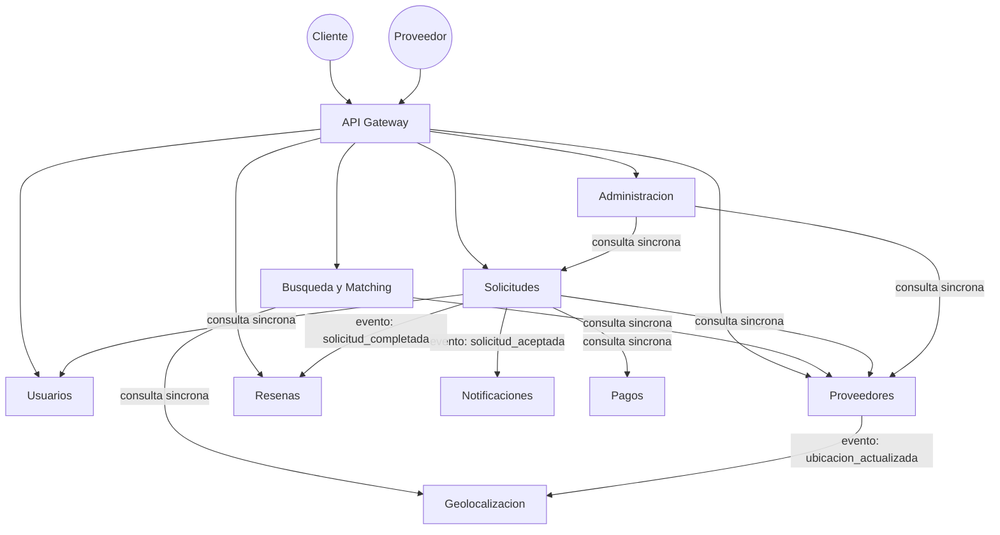

# Mapa de Dominios de Negocio

## Contexto

Antes de nombrar un solo microservicio, se identificaron los dominios de
negocio (bounded contexts) de Fixia. Este mapa es la fuente de verdad que
luego se traduce, casi 1 a 1, en el catálogo de microservicios (ver
[08-estructura-microservicios/catalogo-microservicios-fixia.md](../08-estructura-microservicios/catalogo-microservicios-fixia.md)).

Identificar los dominios primero (y no las tecnologías primero) evita el
error común de "microservicios por capa técnica" (ej. un servicio solo para
CRUD) en vez de por capacidad de negocio real.

## Dominios identificados

| # | Dominio | Responsabilidad | Tipo de datos crítico |
|---|---|---|---|
| 1 | **Usuarios** | Registro, autenticación y perfil de clientes. | PII (nombre, contacto) |
| 2 | **Proveedores** | Perfil profesional, servicios ofrecidos, documentación de verificación, disponibilidad. | PII + documentos de identidad/verificación |
| 3 | **Geolocalización** | Ubicación en tiempo real de proveedores, cálculo de proximidad, radios de búsqueda. | Ubicación en tiempo real (dato sensible) |
| 4 | **Búsqueda y Matching** | Motor que cruza categoría de servicio + proximidad + disponibilidad + rating para devolver candidatos al cliente. | Índices de solo lectura derivados de otros dominios |
| 5 | **Solicitudes** | Ciclo de vida de una solicitud de servicio: creada → aceptada → en curso → completada / cancelada. | Estado transaccional del negocio |
| 6 | **Pagos** | Procesamiento de pagos, comisión de plataforma, facturación. | Datos financieros (máxima sensibilidad) |
| 7 | **Notificaciones** | Envío de push/email/SMS ante eventos del sistema. | Bajo, pero alto volumen |
| 8 | **Reseñas y Calificaciones** | Calificación post-servicio, reputación de proveedores. | Contenido generado por usuario |
| 9 | **Administración / Backoffice** | Moderación, verificación manual de proveedores, soporte a incidencias. | Acceso privilegiado a otros dominios (vía API, no DB directa) |

## Relaciones entre dominios

**Cómo leer el diagrama:** las flechas sólidas etiquetadas "consulta
síncrona" son llamadas REST/gRPC que esperan respuesta inmediata (ej. el
cliente no puede ver resultados de búsqueda sin consultar Geolocalización).
Las flechas etiquetadas "evento" son comunicación asíncrona: el dominio
emisor no espera respuesta ni bloquea su flujo si el receptor está caído
(ver [Circuit Breaker](../07-calidad-arquitectura/patrones-diseno.md) y
Event-Driven en [tecnicas-metodos](../03-decisiones-arquitectura/tecnicas-metodos/)).

## Por qué esta separación y no otra

- **Geolocalización se separa de Proveedores** aunque a primera vista
  parezcan lo mismo, porque su patrón de acceso es radicalmente distinto:
  Proveedores cambia poco (perfil, servicios) y Geolocalización cambia todo
  el tiempo (ubicación en tiempo real). Mezclarlos forzaría a escalar todo
  el perfil de proveedor solo para soportar el volumen de escritura de
  ubicación.
- **Búsqueda y Matching es su propio dominio** y no vive dentro de
  Proveedores, porque es un dominio de lectura intensiva que combina datos
  de varios orígenes (proveedor + geolocalización + reseñas). Aislarlo
  permite optimizarlo con índices/caches propios sin acoplar su ciclo de
  vida al de Proveedores.
- **Pagos está completamente aislado** por el nivel de sensibilidad de sus
  datos y porque probablemente sea el primer candidato a integrarse con un
  proveedor externo (pasarela de pago), lo cual exige un límite de dominio
  muy claro.
- **Solicitudes actúa como orquestador del flujo principal de negocio**
  (el "camino feliz": cliente pide servicio → proveedor acepta → se
  completa → se cobra → se reseña), por lo que es el dominio con más
  dependencias síncronas hacia otros.

## Siguiente paso

Este mapa se traduce en nombres de repositorio concretos en
[08-estructura-microservicios/catalogo-microservicios-fixia.md](../08-estructura-microservicios/catalogo-microservicios-fixia.md),
siguiendo la convención `fixia-msv-<dominio>`.