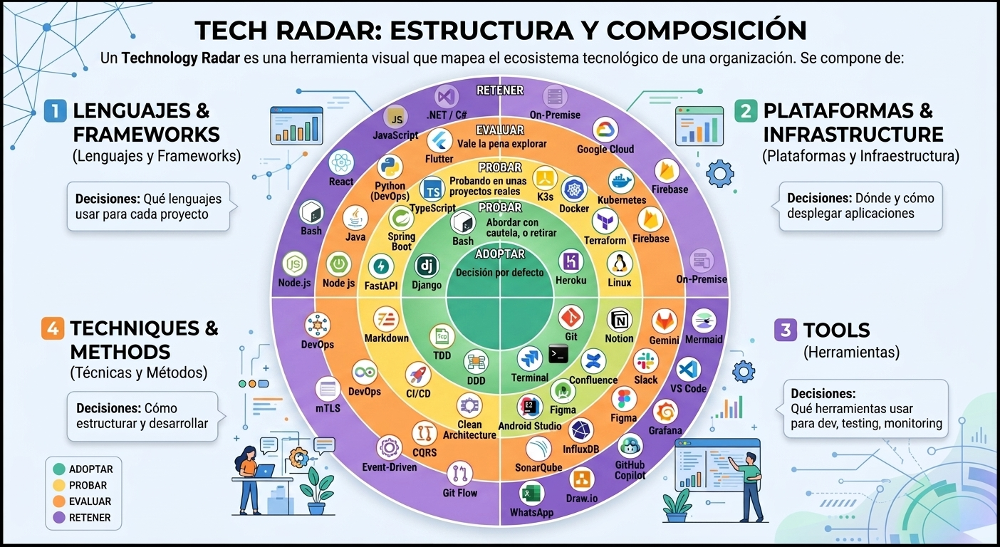

# 02. Tech Radar

## ¿Qué es el Tech Radar de Fixia?

Es el mapa visual de todo el ecosistema tecnológico que usamos (o estamos
evaluando usar) en el proyecto. Cada tecnología aparece una sola vez,
ubicada en un **cuadrante** (qué tipo de decisión es) y en un **anillo**
(qué tan comprometidos estamos con ella).

El radar no reemplaza a esta wiki: es su **índice visual**. Cada
tecnología que aparece en el radar tiene (o debería tener) una página de
decisión propia dentro de
[03-decisiones-arquitectura](../03-decisiones-arquitectura/), siguiendo la
[plantilla de decisión](../00-inicio/plantilla-decision.md).

## Los 4 cuadrantes

| Cuadrante | Qué tipo de decisión agrupa | Ejemplos del radar |
|---|---|---|
| **Lenguajes & Frameworks** | Con qué lenguaje/framework se construye un componente | Node.js, TypeScript, Python, Java, .NET/C#, React, FastAPI, Django, Spring Boot |
| **Plataformas & Infrastructure** | Dónde y cómo se despliega el software | On-Premise, Docker, K3s/Kubernetes, Terraform, Google Cloud |
| **Tools** | Con qué herramientas se trabaja día a día (dev, testing, monitoreo, comunicación) | Git, Jira, VS Code, Figma, SonarQube, Grafana |
| **Techniques & Methods** | Cómo se estructura y desarrolla el software | Clean Architecture, DDD, CQRS, TDD, Event-Driven, mTLS |

## Los 4 anillos (nivel de compromiso)

Este es el criterio más importante del radar, porque define qué se puede
usar libremente y qué requiere una conversación con el equipo antes.

| Anillo | Significado | Qué implica en la práctica |
|---|---|---|
| 🟢 **Adoptar** | Decisión por defecto. Es lo que un desarrollador debería usar sin pedir permiso. | Está documentado, tiene soporte del equipo, y es la opción esperada en nuevo código. |
| 🟡 **Probar** | Se está usando en algunos proyectos reales, con cautela. | Válido para usarlo en un microservicio nuevo o una funcionalidad acotada, mbut se espera reportar aprendizajes al equipo. |
| 🟠 **Evaluar** | Vale la pena explorarlo, pero todavía no en producción real. | Uso limitado a spikes, pruebas de concepto o entornos de desarrollo, nunca en un flujo crítico de negocio. |
| 🟣 **Retener** | Es lo que ya usamos de forma consolidada y no debe reemplazarse sin una razón fuerte, o es una tecnología que decidimos no adoptar. | Requiere una página de decisión que explique por qué se retiene/evita, no solo que "ya la usamos". |

**Nota sobre el anillo Retener:** en el radar visual, "Retener" agrupa tanto
tecnologías ya consolidadas y estables (ej. .NET/C#, On-Premise) como
aquello que decidimos **no** usar. La página de decisión de cada tecnología
debe aclarar cuál de los dos casos aplica.

## Cómo se mueve una tecnología entre anillos

1. Cualquier miembro del equipo puede proponer evaluar una tecnología nueva
   siguiendo el proceso de [CONTRIBUTING.md](../CONTRIBUTING.md).
2. Toda tecnología nueva entra al radar en **Evaluar**, con su página de
   decisión inicial (aunque esté incompleta en la sección de trade-offs).
3. Pasa a **Probar** cuando se usó en al menos un microservicio o
   componente real, no solo en un spike aislado.
4. Pasa a **Adoptar** cuando el equipo decide explícitamente que es la
   opción por defecto para ese tipo de decisión, y se actualiza la
   documentación relacionada (ej. el checklist de bootstrap de
   microservicios en el capítulo 08).
5. Una tecnología en **Adoptar** puede bajar a **Retener** (como "ya
   consolidada, no tocar sin razón") si se reemplaza en nuevo desarrollo
   pero sigue viva en sistemas existentes.

## Revisión del radar

Se recomienda revisar el radar completo junto con la auditoría interna
semestral mencionada en
[04-gobierno-ciclo-vida/estandares-internacionales.md](../04-gobierno-ciclo-vida/estandares-internacionales.md),
para confirmar que ninguna tecnología quedó desactualizada de anillo.

## Contenido de este capítulo

Este capítulo es intencionalmente corto: su función es explicar el radar
como herramienta. El contenido técnico real de cada tecnología vive en
[03-decisiones-arquitectura](../03-decisiones-arquitectura/).