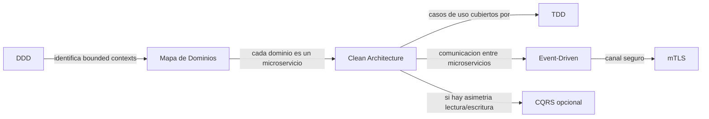

# Técnicas & Métodos

Decisiones sobre **cómo se estructura y desarrolla** el software de Fixia:
patrones de arquitectura, prácticas de diseño y metodologías de trabajo a
nivel de código (no de gestión de proyecto — eso vive en
[04-gobierno-ciclo-vida](../../04-gobierno-ciclo-vida/)).

| Técnica/Método | Estado en el radar | Para qué | Página |
|---|---|---|---|
| Clean Architecture | 🟢 Adoptar | Estructura interna de todo microservicio | [clean-architecture.md](./clean-architecture.md) |
| TDD | 🟢 Adoptar | Disciplina de pruebas por defecto | [tdd.md](./tdd.md) |
| DDD (Domain-Driven Design) | 🟡 Probar | Modelado de dominios complejos | [ddd.md](./ddd.md) |
| Event-Driven | 🟡 Probar | Comunicación asíncrona entre microservicios | [event-driven.md](./event-driven.md) |
| CQRS | �� Evaluar | Separación lectura/escritura en dominios asimétricos | [cqrs.md](./cqrs.md) |
| mTLS | �� Evaluar | Autenticación fuerte entre microservicios | [mtls.md](./mtls.md) |

## Cómo se relacionan estas técnicas entre sí

No son piezas aisladas: en Fixia se combinan según el tipo de dominio.

El [mapa de dominios de negocio](../../01-contexto-proyecto/mapa-dominios-negocio.md)
ya aplicó el pensamiento de DDD de forma implícita (separar Geolocalización
de Proveedores, por ejemplo). Clean Architecture es cómo se construye
**cada** microservicio resultante de ese mapa. TDD es la disciplina para
cubrir esos casos de uso con pruebas. Event-Driven y CQRS son técnicas que
se aplican **selectivamente**, no en todos los microservicios por igual.

## Nivel de exigencia: obligatorio vs. según el caso

A diferencia del cuadrante de Herramientas, donde "Adoptar" suele
significar "usalo siempre", en Técnicas & Métodos hay matices importantes:

- **Clean Architecture y TDD son obligatorios** en todo microservicio
  nuevo — son la base estructural mínima, sin excepción.
- **DDD, Event-Driven, CQRS y mTLS se aplican donde el dominio lo
  justifica**, no de forma universal. Forzarlos en un dominio simple (ej.
  Reseñas) agregaría complejidad sin beneficio.

Cada página de esta subcarpeta indica explícitamente en qué dominios de
Fixia aplica y en cuáles no.

